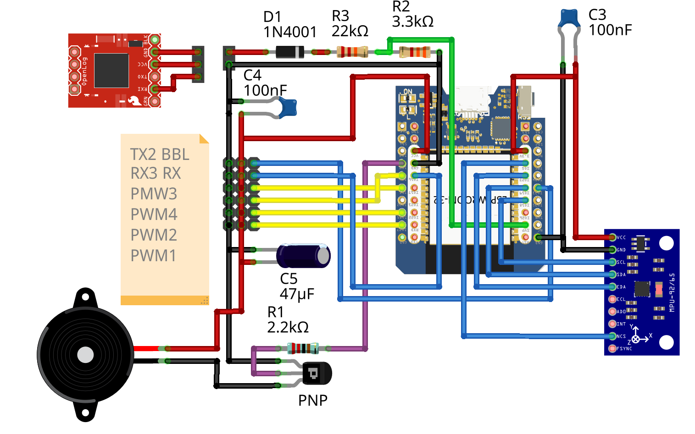
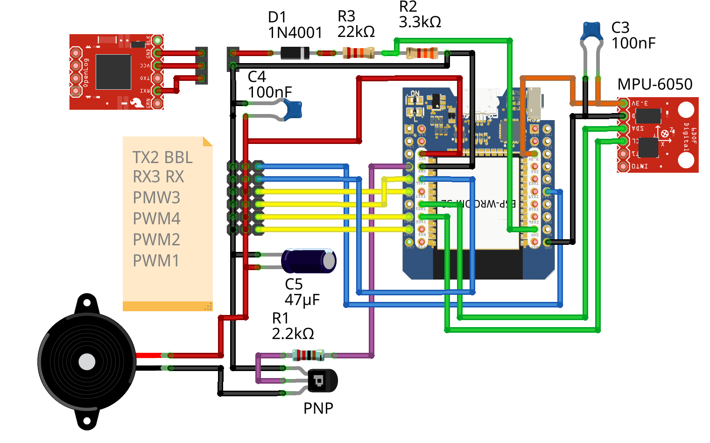
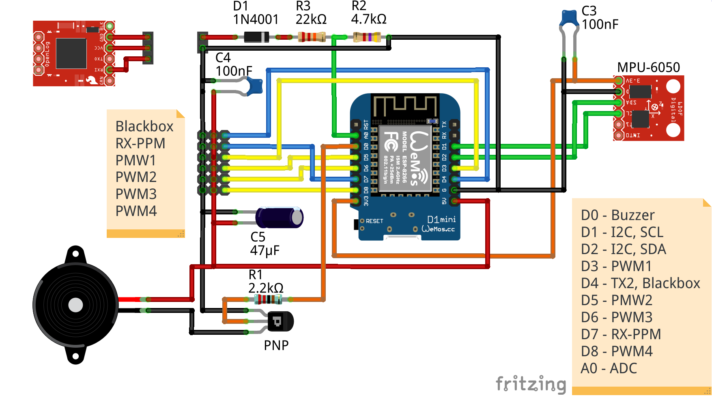

# ESP-FC wiring examples and PIN mapping

ESP32 MCUs allows to remap pins, so the wiring is not final and you can remap intputs and outputs to your needs. To change pin function go to the CLI and use `get pin` command to check current assignment. For example, to set first output to pin 1 use command 

`set pin_output_0 1`

Tu unmap pin function use -1 as pin number

`set pin_output_3 -1`

> [!NOTE]
> There are still some limitations in remapping. Not all pins can be used with all functions. Some pins are input only, others are strapping pins and may prevent from booting if used incorrectly. please consult MCU documentation for available options. Default layout is proven to work.

## Default I2C pin mapping for gyro modules

| Module Pin | CLI Name         | ESP32 | ESP32-S3 |
|------------|------------------|------:|---------:|
| SCK/SCL    | `pin_i2c_scl`    | 22    | 10       |
| SDA/SDI    | `pin_i2c_sda`    | 21    | 9        |

> [!NOTE]
> I2C driver accepts only pins from 1 to 31

## Default SPI pin mapping gyro modules

| Module Pin  | CLI Name         | ESP32 | ESP32-S3 |
|-------------|------------------|------:|---------:|
| SCK/SCL     | `pin_spi_0_sck`  | 18    | 12       |
| SDA/SDI     | `pin_spi_0_mosi` | 23    | 11       |
| SAO/SDO/ADO | `pin_spi_0_miso` | 19    | 13       |
| NCS         | `pin_spi_cs_0`   |  5    |  8       |
| CSB*        | `pin_spi_cs_1`   | 13    |  7       |

**Note:** `CSB` is required for barometer on 10-DOF MPU-9250 modules

> [!TIP]
> For better performance preffer SPI

## Default Servo/Motor output mapping

| Motor  | CLI name       | ESP32 | ESP32-S3 |
|-------:|----------------|------:|---------:|
| 1      | `pin_output_0` | 27    | 39       |
| 2      | `pin_output_1` | 25    | 40       |
| 3      | `pin_output_2` | 4     | 41       |
| 4      | `pin_output_3` | 12    | 42       |

## Default Uart/Serial pin mapping

| Uart | CLI name          | ESP32 | ESP32-S3 |
|-----:|-------------------|------:|---------:|
| RX 1 | `pin_serial_0_rx` |  3    | 44       |
| TX 1 | `pin_serial_0_tx` |  1    | 43       |
| RX 2 | `pin_serial_1_rx` | 32    | 15       |
| TX 2 | `pin_serial_1_tx` | 33    | 16       |
| RX 3 | `pin_serial_2_rx` | 16    | 17       |
| TX 4 | `pin_serial_2_tx` | 17    | 18       |

## Default Analog pin mapping

| Uart    | CLI name          | ESP32 | ESP32-S3 |
|--------:|-------------------|------:|---------:|
| Voltage | `pin_input_adc_0` |  36   | 1        |
| Current | `pin_input_adc_1` |  19   | 4        |

> [!NOTE]
> On ESP32 choose only pins assigned to ADC1 channels

## Default PPM receiver pin mapping

| Uart    | CLI name       | ESP32 | ESP32-S3 |
|--------:|----------------|------:|---------:|
| PPM     | `pin_input_rx` |  35   | 6        |

## Other pin functions

| CLI name            | ESP32 | ESP32-S3 | Comment       |
|---------------------|------:|---------:|---------------|
| `pin_buzzer`        |  0    | 5        | Status buzzer |
| `pin_led`           |  26   | -        | Status led    |

## Example ESP32 SPI MPU-6500/MPU-9250 gyro

## Example ESP32 I2C MPU-6050 gyro

## Example ESP8266 I2C MPU-6050 gyro

ESP8266 has limited ability to remap pins, use `get pin` command to list available options.

